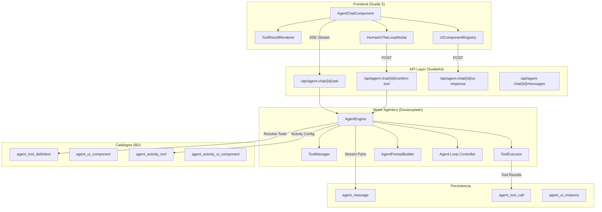
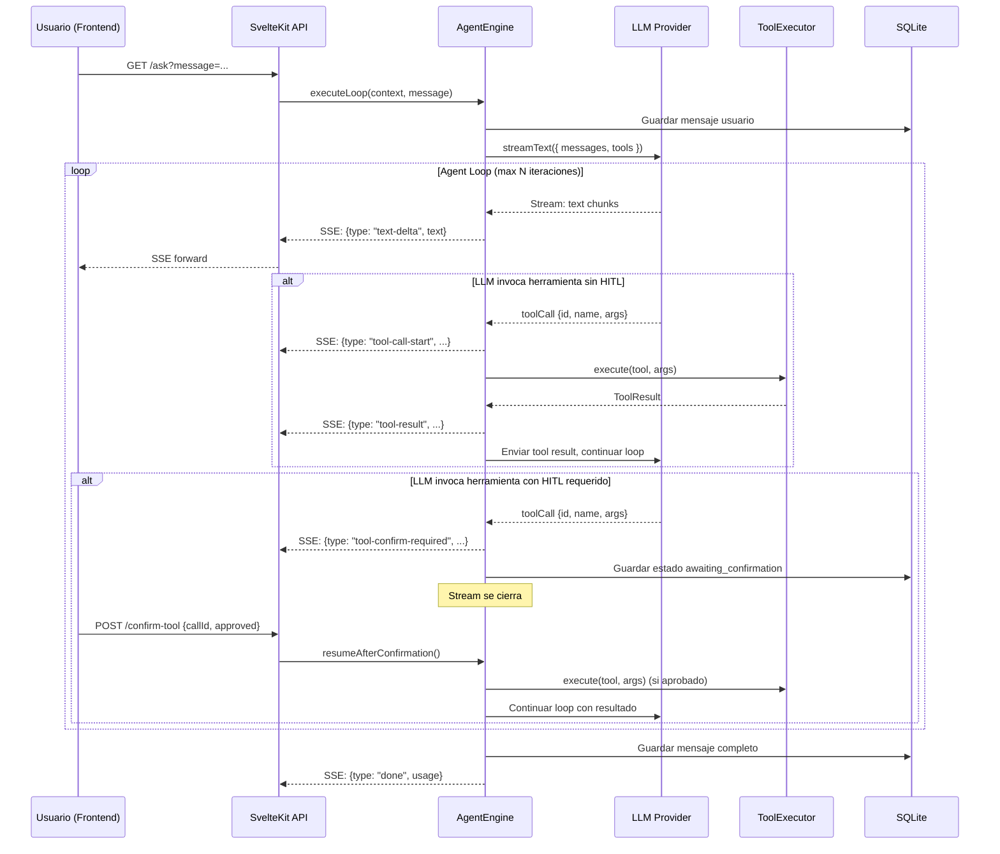

# Plan de Implementación Arquitectónico: Upgrade Agéntico de Sapin

> Generado: 2026-02-24
> Estado: En progreso - Fase 1

## Índice

1. [Arquitectura del Sistema (Alto Nivel)](#1-arquitectura-del-sistema)
2. [Modelo de Datos / Catálogos](#2-modelo-de-datos)
3. [Flujo de Comunicación (Payloads)](#3-flujo-de-comunicación)
4. [Diseño de Interfaces de Administración](#4-diseño-de-interfaces)
5. [Fases de Implementación (Roadmap)](#5-fases-de-implementación)
6. [Riesgos y Mitigaciones](#6-riesgos-y-mitigaciones)

---

## 1. Arquitectura del Sistema

### 1.1 Principio Fundamental: Aislamiento Total

El sistema actual (`type: 'chat'` → `interactiveLearningChat`) permanece **intacto**. Se crea un sistema paralelo:

| Concepto | Sistema Actual | Sistema Nuevo |
|----------|---------------|---------------|
| Tipo de actividad | `chat` | `agent` |
| Tabla de config | `interactiveLearningChat` | `interactiveLearningAgent` |
| Componente frontend | `ChatComponent.svelte` | `AgentChatComponent.svelte` |
| Motor backend | `AIUtils.streamChatResponse()` | `AgentEngine.executeLoop()` |
| API endpoints | `/api/interactive-chat/` | `/api/agent-chat/` |
| Formato de mensaje | `{ content: string, type }` | `AgentMessage` (multipart) |

### 1.2 Arquitectura General (Mermaid)



### 1.3 Motor Agéntico: Diseño Desacoplado

El motor agéntico es **agnóstico al tipo de actividad**. Se instancia con un `AgentContext` que proporciona las herramientas disponibles, y una implementación de `AgentPersistence` que determina dónde se almacenan los resultados.

**Punto clave de reutilización:** Para integrar el motor en otra área, solo se necesita:
1. Crear una nueva implementación de `AgentPersistence`
2. Construir un `AgentContext` con las herramientas relevantes
3. Conectar los endpoints SSE al `AgentEngine`

### 1.4 Agent Loop (Flujo del Bucle Agéntico)



---

## 2. Modelo de Datos / Catálogos

### 2.1 Nuevo Archivo de Schema

**Archivo:** `src/lib/server/db/schema/agent.ts`

#### Tablas principales:

**`agent_tool_definition`** — Catálogo global de herramientas
- `name` (unique): Identificador técnico (`search_course_content`)
- `displayName`: Nombre para mostrar al usuario
- `description`: Para el LLM (describe cuándo usar la herramienta)
- `category`: `knowledge` | `evaluation` | `communication` | `data`
- `parametersSchema`: JSON Schema de los parámetros
- `responseSchema`: JSON Schema de la respuesta (para salidas estructuradas)
- `executorType`: `builtin` | `http` | `script`
- `executorConfig`: JSON con configuración del executor
- `requiresConfirmation`: HITL flag
- `riskLevel`: `low` | `medium` | `high`

**`interactive_learning_agent`** — Config de actividad tipo agente (1:1 con `interactiveLearning`)
- Mismos campos LLM que `interactiveLearningChat`
- `maxToolRoundtrips`: Límite del loop (default: 5)
- `parallelToolCalls`: Ejecución paralela
- `toolChoice`: `auto` | `required` | `none`

**`agent_activity_tool`** — Herramientas habilitadas por actividad
- FK a `interactiveLearningAgent` + FK a `agentToolDefinition`
- `configOverride`: JSON para override por actividad

**`agent_ui_component`** — Catálogo global de componentes UI
- `componentKey`: Clave en `UIComponentRegistry` frontend
- `propsSchema`: JSON Schema que el LLM debe generar
- `responseSchema`: JSON Schema del payload que emite el componente

**`agent_activity_ui_component`** — Componentes UI habilitados por actividad

**`agent_message`** — Mensajes agénticos (reemplaza `message` para type=agent)
- `role`: `user` | `assistant` | `system` | `tool`
- `textContent`: Contenido textual
- `toolCallId`: Referencia al toolCall que generó este mensaje (para role=tool)
- `sequenceOrder`: Orden dentro del mensaje compuesto

**`agent_tool_call`** — Tool calls del assistant
- `arguments`: JSON de args enviados
- `result`: JSON del resultado
- `status`: `pending` | `awaiting_confirmation` | `executing` | `completed` | `failed` | `rejected`
- `confirmedBy` / `confirmedAt`: Para HITL

**`agent_ui_instance`** — Instancias de componentes UI en mensajes
- `props`: JSON generado por el LLM
- `state`: JSON del estado persistente (actualizado por el usuario)
- `userResponse`: JSON del payload emitido por el componente
- `score`: 0.0 - 1.0 (para componentes de evaluación)

### 2.2 Compatibilidad con Sistema Existente

- `chat` existente se **reutiliza** como contenedor de sesión
- `userInteractiveLearningChat` se **reutiliza** para vincular user↔activity↔chat
- `interactiveLearning.type = 'agent'` diferencia el tipo
- Tabla `message` existente queda **sin modificar**
- Sistema de quotas (`aiQuota`, `aiUsageLog`) se **reutiliza** sin cambios

---

## 3. Flujo de Comunicación (Payloads)

### 3.1 Protocolo SSE: AgentStreamPart

Cada evento SSE tiene la forma: `data: {"type": "<part-type>", ...payload}\n\n`

#### Tipos de partes:

```typescript
type AgentStreamPart =
    | { type: 'text-delta'; text: string }
    | { type: 'tool-call-start'; toolCallId: string; toolName: string; toolDisplayName: string; args: Record<string, unknown> }
    | { type: 'tool-call-delta'; toolCallId: string; status: 'executing' | 'streaming'; progressText?: string }
    | { type: 'tool-result'; toolCallId: string; toolName: string; result: unknown; displayResult?: string; status: 'completed' | 'failed'; durationMs: number }
    | { type: 'tool-confirm-required'; toolCallId: string; toolName: string; toolDisplayName: string; args: Record<string, unknown>; riskLevel: 'low' | 'medium' | 'high'; confirmationMessage: string }
    | { type: 'ui-component'; instanceId: string; componentKey: string; props: Record<string, unknown>; interactive: boolean }
    | { type: 'status'; status: 'thinking' | 'calling-tools' | 'generating-ui' | 'finalizing'; message?: string }
    | { type: 'error'; code: string; message: string }
    | { type: 'done'; usage: { inputTokens: number; outputTokens: number; totalTokens: number; toolCallsCount: number; estimatedCost: number }; finishReason: string };
```

### 3.2 Mensajes Cliente → Servidor

```typescript
// POST /api/agent-chat/{id}/confirm-tool
interface ToolConfirmationRequest {
    toolCallId: string;
    approved: boolean;
    rejectionReason?: string;
}

// POST /api/agent-chat/{id}/ui-response
interface UIComponentResponse {
    instanceId: string;
    componentKey: string;
    payload: Record<string, unknown>;
}
```

### 3.3 Cómo el LLM Genera UI Components

Las UI generativas se modelan como **herramientas especiales** con `executorType: 'builtin'` y `handler: 'ui_renderer'`. Cuando el `ToolExecutor` detecta este handler, en lugar de ejecutar lógica de backend, emite un `UIComponentPart` con las props generadas por el LLM.

---

## 4. Diseño de Interfaces de Administración

### 4.1 Admin Global

- `/admin/agent-tools` — CRUD del catálogo de herramientas (tabla + modal edición)
- `/admin/agent-ui-components` — CRUD del catálogo de componentes UI

### 4.2 Configuración de Actividad (Curso)

- En selector de tipo de actividad: añadir opción "Agente"
- Formulario de actividad agéntica: mismos campos LLM + sección "Herramientas Habilitadas" (checkboxes del catálogo global) + sección "Componentes UI Habilitados"

### 4.3 Nuevas Entradas en Sidebar Admin

```typescript
{ name: 'Herramientas Agent', path: '/admin/agent-tools', minLevel: ROLE_LEVELS.ADMIN },
{ name: 'Componentes UI Agent', path: '/admin/agent-ui-components', minLevel: ROLE_LEVELS.ADMIN },
```

---

## 5. Fases de Implementación (Roadmap)

### ✅/🔲 Fase 1: Infraestructura Core y Motor Agéntico Base

**Objetivo:** Motor agéntico funcional con tool calling básico (sin UI components, sin HITL)

#### Backend
- [ ] `src/lib/server/db/schema/agent.ts` — tablas: `agentToolDefinition`, `interactiveLearningAgent`, `agentActivityTool`, `agentMessage`, `agentToolCall`
- [ ] Migración de BD (`npm run db:push`)
- [ ] Añadir `AGENT: 'agent'` a `interactiveLearningTypes` en `constants.ts`
- [ ] `src/lib/types/agent.ts` — tipos TypeScript de `AgentStreamPart`, `AgentContext`, `ToolDefinition`, etc.
- [ ] `src/lib/server/agent/AgentEngine.ts` — bucle agéntico con Vercel AI SDK `streamText({ tools })`
- [ ] `src/lib/server/agent/ToolManager.ts` — resolver herramientas de BD a formato Vercel AI SDK
- [ ] `src/lib/server/agent/ToolExecutor.ts` — ejecutar herramientas builtin
- [ ] `src/lib/server/agent/AgentPromptBuilder.ts` — system prompts incluyendo descripción de herramientas
- [ ] `src/lib/server/agent/builtins/` — herramientas builtin iniciales:
  - `searchCourseContent.ts` (búsqueda RAG)
  - `getStudentProgress.ts` (consulta progreso)
  - `calculateExpression.ts` (evaluador matemático)
- [ ] `src/lib/server/db/DBAgentUtils.ts` — queries CRUD para tablas de agente
- [ ] Endpoints API:
  - `POST /api/agent-chat/[ilcid]/chat/+server.ts` — crear sesión
  - `GET /api/agent-chat/[ilcid]/chat/[cid]/ask/+server.ts` — stream SSE agéntico
  - `GET /api/agent-chat/[ilcid]/chat/[cid]/messages/+server.ts` — historial
- [ ] Seed de herramientas builtin iniciales en BD

#### Frontend
- [ ] `src/lib/components/AgentChatComponent.svelte` — nuevo componente que parsea `AgentStreamPart`
- [ ] Renderizado: texto streameado + bloques de tool call (start → executing → result)
- [ ] Páginas de chat agéntico:
  - `src/routes/(app)/agent-chat/[ilid]/+page.svelte`
  - `src/routes/(app)/agent-chat/[ilid]/c/[cid]/+page.svelte`

#### Admin (básico)
- [ ] Formulario de creación de actividad agéntica (extensión del existente)

**Entregable Fase 1:** Un profesor puede crear una actividad tipo "agente", un estudiante puede chatear con el agente, y el agente puede invocar herramientas automáticamente (RAG, progreso, cálculos).

---

### 🔲 Fase 2: Human-in-the-Loop + Admin de Herramientas

**Objetivo:** Confirmación de usuario para herramientas de riesgo + panel admin completo

- HITL en `AgentEngine`: pausar → persistir → endpoint confirmación → retomar
- `HumanInTheLoopModal.svelte`
- API CRUD admin herramientas + UI `/admin/agent-tools`
- Herramientas adicionales: `save_grade`, `send_notification` (requieren HITL)

---

### 🔲 Fase 3: Generative UI (Componentes Interactivos)

**Objetivo:** Componentes UI interactivos renderizados inline en el chat

- Tablas: `agentUIComponent`, `agentActivityUIComponent`, `agentUIInstance`
- `UIComponentRegistry.ts` en frontend
- Componentes: `QuizCard.svelte`, `FlashcardDeck.svelte`, `CodeExercise.svelte`
- Endpoint `/api/agent-chat/{id}/ui-response`
- Restauración de estado entre recargas

---

### 🔲 Fase 4: Analítica, Salidas Estructuradas y Pulido

**Objetivo:** Dashboards de analítica agéntica + preparación para reutilización

- Métricas: herramientas más usadas, tasa HITL, scores quizzes
- Export de resultados estructurados
- Documentar API del motor agéntico para integración futura
- Prototipo: asistente global de tutoría

---

## 6. Riesgos y Mitigaciones

| # | Riesgo | Mitigación |
|---|--------|------------|
| 1 | Token consumption explosion | `maxToolRoundtrips` configurable (default: 5). Sistema de quotas existente activo. |
| 2 | Latencia del loop | Streaming desde el inicio. Indicadores de progreso por step. Timeout por herramienta (10s). |
| 3 | Hallucinated tool calls | Validación Zod de `parametersSchema` antes de ejecución. Retry con feedback al LLM. |
| 4 | Seguridad de herramientas | `AgentContext` con userId/courseId filtra todas las queries. Sin eval de código arbitrario. HITL obligatorio para riesgo ≥ medium. |
| 5 | Complejidad HITL | Stream se cierra al requerir confirmación. POST separado para confirmar. Nuevo stream para retomar. Estado persiste en BD. |
| 6 | Proveedor sin tool calling | Campo `supportsToolCalling` en `aiModel`. Formulario filtra modelos incompatibles. |
| 7 | Concurrencia confirmaciones | Tool calls en `awaiting_confirmation` persisten. Al recargar, frontend restaura modal. Timeout de 10 min auto-rechaza. |
